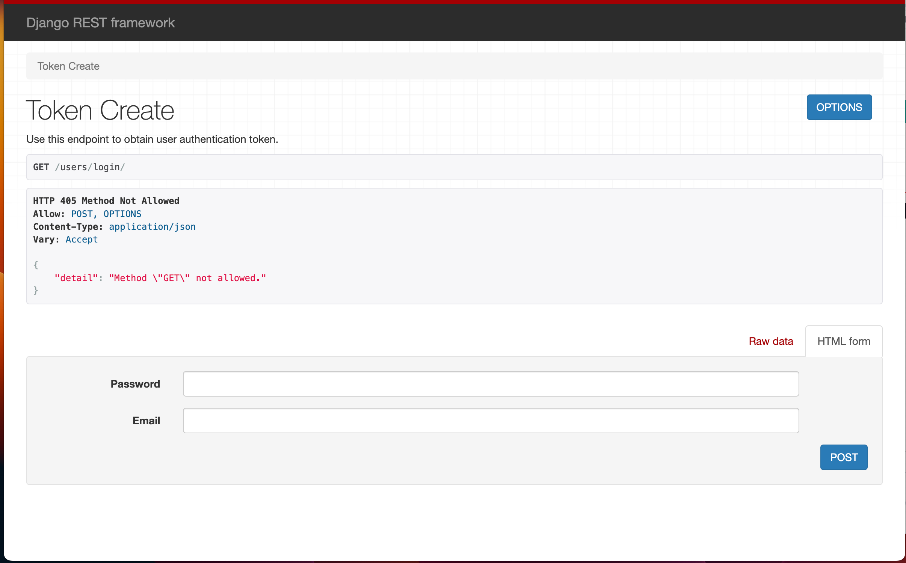
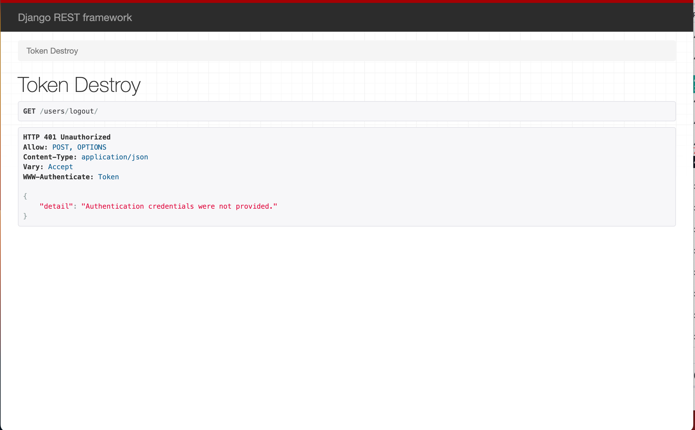

# yetti-assessment

# About The Task
 - Project aims at implementing user authentication and Testing. The project is a django basic application.

### Prerequisites

Make sure you have the following prerequisites installed on your system:

- Python: You can download and install Python from [python.org](https://www.python.org/downloads/).

### Installation

Follow these steps to set up the project:
1. Clone the repository: 
    ```
    git clone https://github.com/K-Honsu/yetti-assessment.git
    ```
2. Navigate to the Project Directory
    ```
    cd yetti-assessment/
    ```
3. Create a virtual environment (optional but recommended):
    ```
    python3 -m venv venv
    ```
4. Activate the virtual environment
    ```
    - On Windows :
    venv\Scripts\activate
    ```

    ```
    - On Mac Os/Linux :
    source venv/bin/activate
    ```
5. Install project Dependencies
    ```
    pip install -r requirements.txt
    ```
6. Apply migrations to set up the database:
    ```
    python manage.py makemigrations
    python manage.py migrate
    ```
7. Start the development server:
    ```
    python manage.py runserver
    ```
- This will start the development server on your local machine, and you should see output similar to the following:

```
Starting development server at http://127.0.0.1:8000/
Quit the server with CONTROL-C.
```

- Open a web browser and navigate to the URL that was displayed in the output. You should see the Django project running on your local machine.

- Congratulations, you have now successfully run a Django Python backend on the local server!

## Usage 
- To register a new user, in your web browser, head over to:
```
http://127.0.0.1:8000/auth/users/ : to create a new user
```

- To login a new user, in your web browser, head over to:
```
http://127.0.0.1:8000/users/login/  : to login a new user
```

- To logout a new user, in your web browser, head over to:
```
http://127.0.0.1:8000/users/logout/  : to logout a new user
```



## Testing 
- To test the following endpoints, in yout terminal, run the following command
```
pytest
```